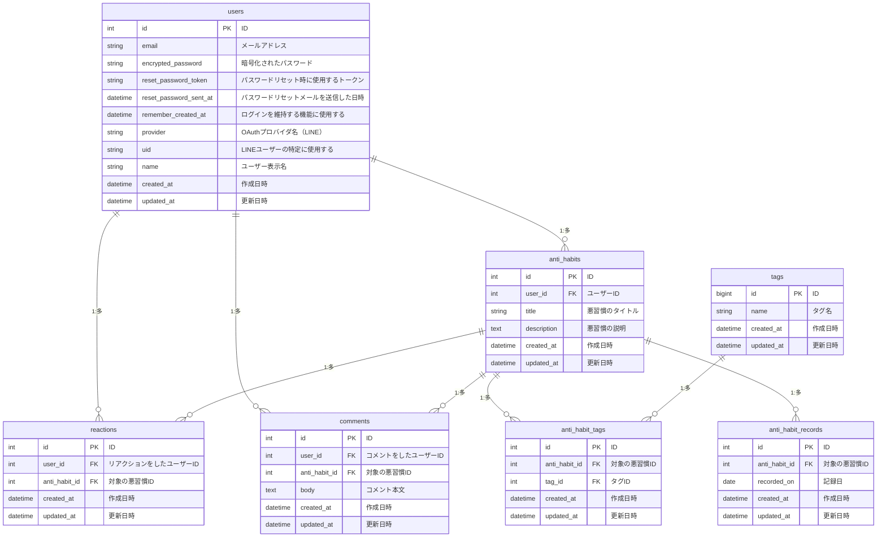

## ■サービス概要
Anti Habitsは悪習慣を取り除く手助けをするサービスです。
悪習慣を共有し、一定間隔で悪習慣をしていないか管理して目標達成を手助けします。
悪習慣を共有することで切磋琢磨できたり、自分以外のユーザに監視されてる錯覚を感じることで目標達成率を高められます。

悪習慣の例
- 休日の前日につい夜更かししてしまう
- お風呂にスマホを持ち込んでしまう
- ダイエットしたいのに大盛りを頼んでしまう

## ■ このサービスへの思い・作りたい理由
自分自身、辞めたいと思っていてもついついやってしまっている習慣・悪い癖が多々ありました。
そのうちの1つに「お風呂にスマホを持ち込んで入浴中にYouTubeを見る」ことがあり、これを辞めたいとずっと思っていました。
妻の協力のもと監視してもらうことでスマホを持ち込むことがなくなり、今では入浴時間が自分を見つめ直したり深く思考する良い時間になっています。
このような悪習慣から効率良く脱却する手助けをしたいと思い、本アプリを考案しました。

## ■ ユーザー層について
- 勉強やバイト、部活動に忙しい学生
  - 少ない学生期間の中で悪習慣を取り除いて、自分がやりたいことにしっかり打ち込むために
- 学生を卒業し社会人になって間もない人
  - 学生時代よりできること・目標・責任も増えるので、より自己管理が大切になるので
- 目標・やりたいことはあるけど時間がないと思っている人
  - 今やっていることの中から惰性で行っている悪習慣を取り除けば少しは時間ができるかも？

## ■サービスの利用イメージ
悪習慣を登録します。
一定期間毎にLINEに通知が来るので、 悪習慣を行ったかどうかアプリ上で入力を行います。
悪習慣とそれを行ったかどうかを共有することで、他のユーザーから擬似的に監視されている感覚になり、 悪習慣を取り除く手助けをしてくれます。
悪習慣を取り除くことで、自分がしたいことにより時間を使えるようになります。

## ■ ユーザーの獲得について
まず最初はXへのシェア機能を実装することで、利用者の拡大を考えています。

## ■ サービスの差別化ポイント・推しポイント
iOSアプリに「NotToDo」と「やらないこと」というアプリがありました。
両方使用してみたのですが、個人利用のみのアプリとなっており、他のユーザーに悪習慣をシェアする機能はありませんでした。
Anti Habitsは他のユーザーから擬似的に監視されている感覚を味わえることが他のサービスとの差別化ポイントとなります。

## ■ 機能候補
### MVP段階
- ユーザー認証と認可機能
- パスワードリセット機能
- 悪習慣一覧画面
- 悪習慣の新規登録・編集・削除
- 悪習慣詳細画面
- 他のユーザーからの応援(いいね)機能
- 他のユーザーからの応援メッセージ(コメント)機能
- 悪習慣の進捗確認(やってしまったかどうかを管理する機能)
- 進捗確認リマインド機能(毎日固定時間でのLINE通知)
- 悪習慣のカテゴリ、タグ機能
- 悪習慣の検索機能(カテゴリ・タグ・タイトルなど)
- 動的OGP
- Xシェア機能

### 本リリース
- 悪習慣の検索機能(オートコンプリート)
- 進捗間隔をユーザー指定にできる機能
- 過去の進捗を確認できる機能
- 悪習慣の非公開機能
- チーム機能(チームを作成し、チーム全体で悪習慣排除を管理できる機能)
- 日記機能
- 達成報告機能
- 進捗更新をカレンダーで確認できる機能(サンクコスト・ゲーミフィケーションを意識)
- 他のユーザーからのリアクション機能(応援以外に「Wow」や「見てるよ」などユーモア性を重視したもの)
- 連続進捗更新のランキング機能

## ■ 機能の実装方針予定
### MVP段階
- 進捗確認リマインド機能(毎日固定時間でのLINE通知)
  - LINE Messaging API
  - cron
- 動的OGP
  - meta-tags
  - minimagic

### 本リリース
- 悪習慣の検索機能(オートコンプリート)
  - Stimulus Autocomplete
- 進捗間隔をユーザー指定にできる機能
  - LINE Messaging API
  - cron
- 悪習慣の非公開機能
  - Pundit
- チーム機能
  - チームテーブルを作成して進捗を管理
- 日記機能
  - 応援メッセージテーブルにカラムを追加して管理
- 達成報告機能
  - 悪習慣登録時に達成期間を設定できるようにする。設定した期間全てで進捗入力をクリアしているかどうかで判定。Xシェアへも誘導
- 進捗更新をカレンダーで確認できる機能
  - simple_calendar
- 連続進捗更新のランキング機能
  - 一定期間以上連続更新しているユーザーの中から多い順に数名表示する

## 技術スタック
- Rails7系
- PostgreSQL
- Tailwind CSS
- Render

## ER図

## 画面遷移図
Figma：https://www.figma.com/design/5EIKs4ZNjtIcXsfwtx5yOk/test-Project?node-id=74-2&t=NkVOgwoO1YP3TxIm-1