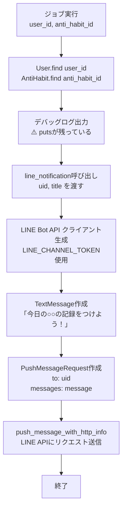

# NotifyLineJob#perform

`app/jobs/notify_line_job.rb` L4-41

非同期ジョブ。LINE Bot APIを使ってユーザーにプッシュ通知を送信する。

```mermaid
flowchart TD
    A[ジョブ実行<br>user_id, anti_habit_id] --> B[User.find user_id<br>AntiHabit.find anti_habit_id]

    B --> C["デバッグログ出力<br>⚠️ putsが残っている"]

    C --> D[line_notification呼び出し<br>uid, title を渡す]

    D --> E[LINE Bot API クライアント生成<br>LINE_CHANNEL_TOKEN使用]

    E --> F["TextMessage作成<br>「今日の○○の記録をつけよう！」"]

    F --> G[PushMessageRequest作成<br>to: uid<br>messages: message]

    G --> H[push_message_with_http_info<br>LINE APIにリクエスト送信]

    H --> I[終了]
```
