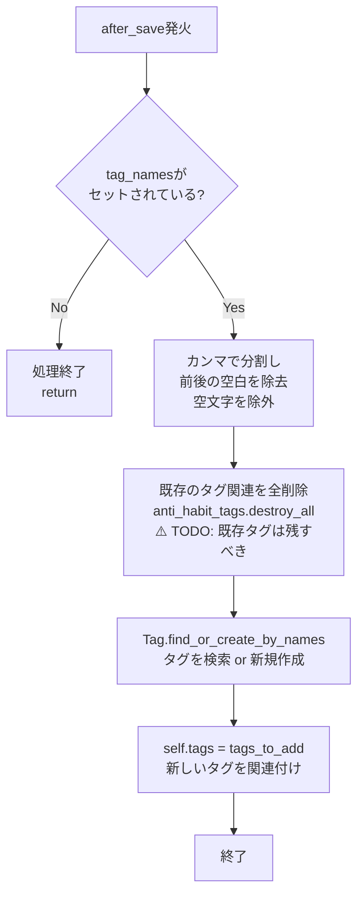

# AntiHabit#save_tags_without_validation

`app/models/anti_habit.rb` L150-162

`after_save`コールバック。カンマ区切りのタグ名を処理し、タグの関連付けを再構築する。

```mermaid
flowchart TD
    A[after_save発火] --> B{tag_namesが<br>セットされている?}

    B -- No --> C[処理終了<br>return]
    B -- Yes --> D[カンマで分割し<br>前後の空白を除去<br>空文字を除外]

    D --> E["既存のタグ関連を全削除<br>anti_habit_tags.destroy_all<br>⚠️ TODO: 既存タグは残すべき"]

    E --> F[Tag.find_or_create_by_names<br>タグを検索 or 新規作成]

    F --> G[self.tags = tags_to_add<br>新しいタグを関連付け]

    G --> H[終了]
```
