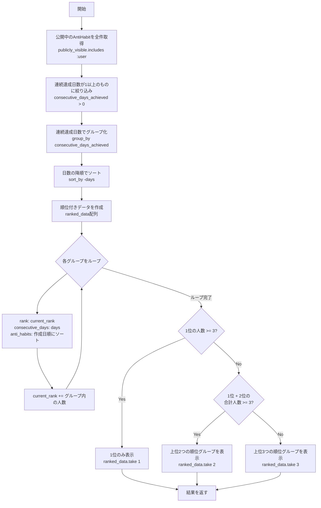

# AntiHabit.top_consecutive_achievers_with_ranks

`app/models/anti_habit.rb` L29-72

ランキングアルゴリズム。公開されている悪習慣を連続達成日数でランク付けし、人数に応じて表示するランク数を動的に制御する。

```mermaid
flowchart TD
    A[開始] --> B[公開中のAntiHabitを全件取得<br>publicly_visible.includes :user]
    B --> C[連続達成日数が1以上のものに絞り込み<br>consecutive_days_achieved > 0]
    C --> D[連続達成日数でグループ化<br>group_by consecutive_days_achieved]
    D --> E[日数の降順でソート<br>sort_by -days]
    E --> F[順位付きデータを作成<br>ranked_data配列]

    F --> G{各グループをループ}
    G --> H[rank: current_rank<br>consecutive_days: days<br>anti_habits: 作成日順にソート]
    H --> I[current_rank += グループ内の人数]
    I --> G

    G -- ループ完了 --> J{1位の人数 >= 3?}

    J -- Yes --> K[1位のみ表示<br>ranked_data.take 1]
    J -- No --> L{1位 + 2位の<br>合計人数 >= 3?}

    L -- Yes --> M[上位2つの順位グループを表示<br>ranked_data.take 2]
    L -- No --> N[上位3つの順位グループを表示<br>ranked_data.take 3]

    K --> O[結果を返す]
    M --> O
    N --> O
```
