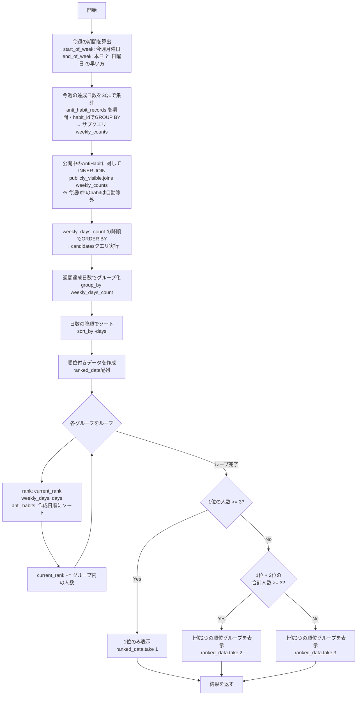

# AntiHabit.top_weekly_achievers_with_ranks

`app/models/anti_habit.rb` L32-73

週間達成ランキングアルゴリズム。今週（月曜〜本日）の達成日数をSQLで集計し、公開中の悪習慣をランク付けする。人数に応じて表示するランク数を動的に制御する。

## 旧実装（top_consecutive_achievers_with_ranks）との違い

| 観点 | 旧実装 | 新実装 |
|------|--------|--------|
| 集計対象 | 連続達成日数（全期間） | 今週（月曜〜本日）の達成日数 |
| データ取得 | Ruby側で全件ロード後に `.select` | SQLのINNER JOINで除外 |
| ソート | Rubyで `sort_by` | DBに `ORDER BY` を委譲 |
| 0件除外 | `consecutive_days_achieved > 0` をRubyで評価 | INNER JOINにより自動除外 |
